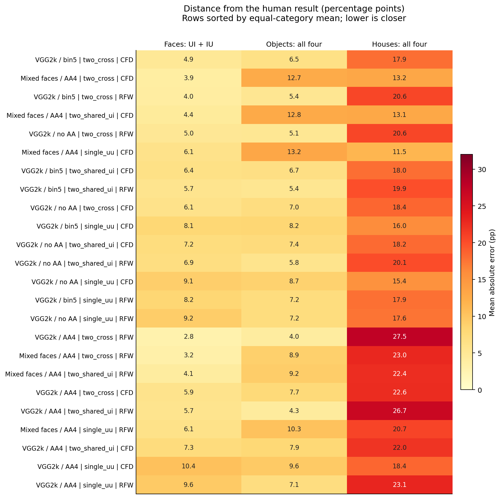
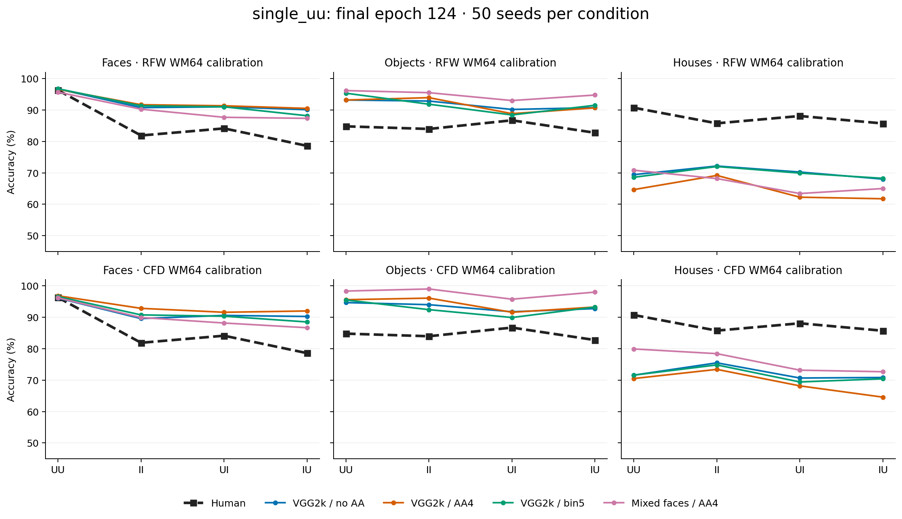
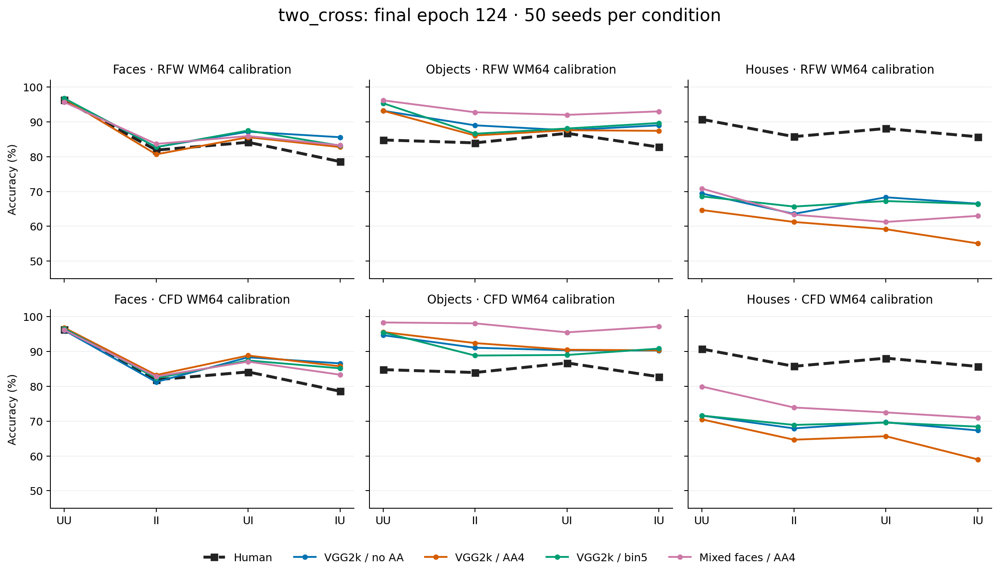
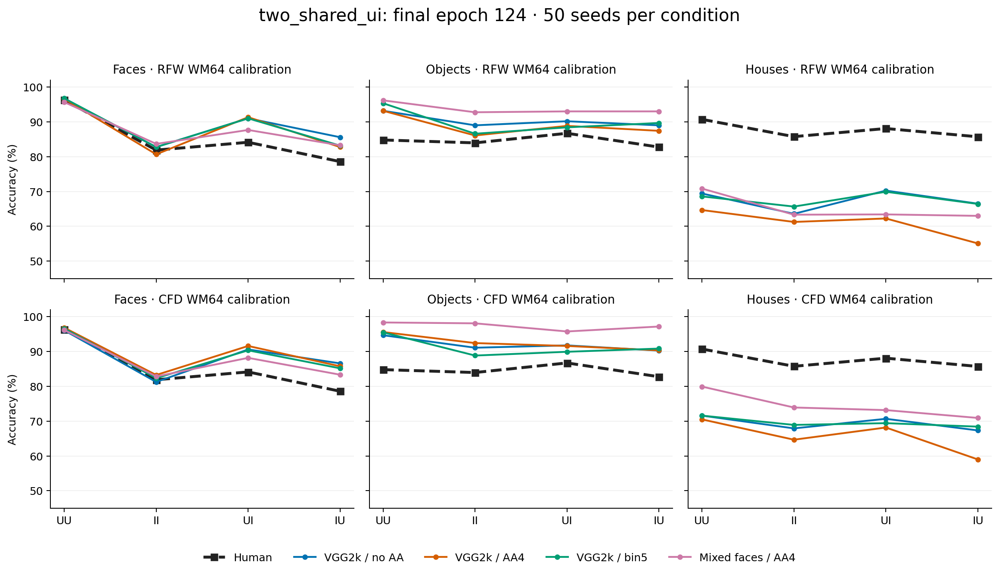
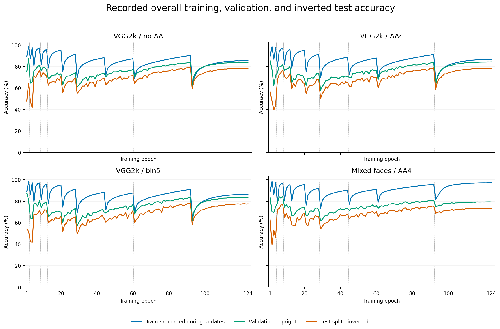
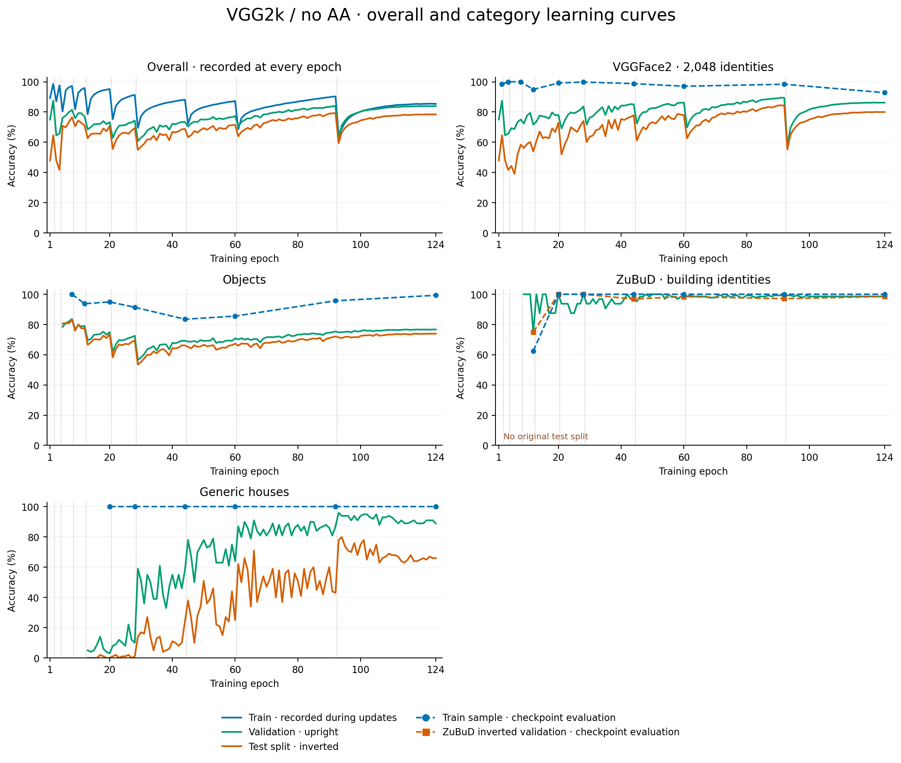
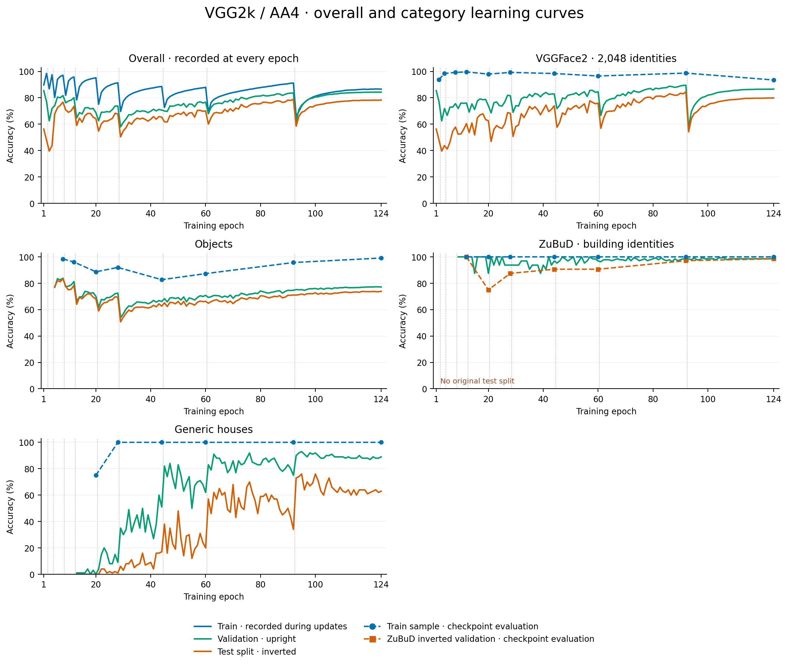
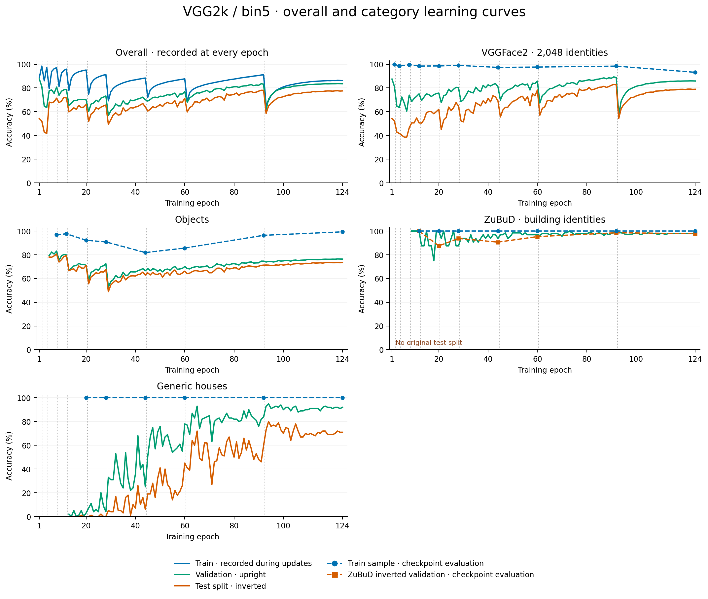
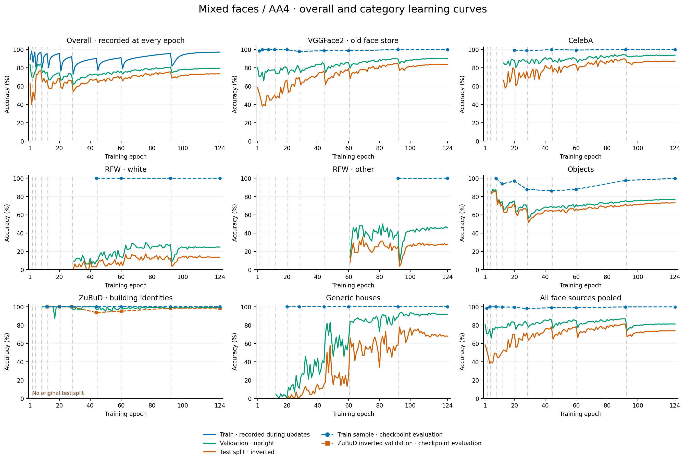
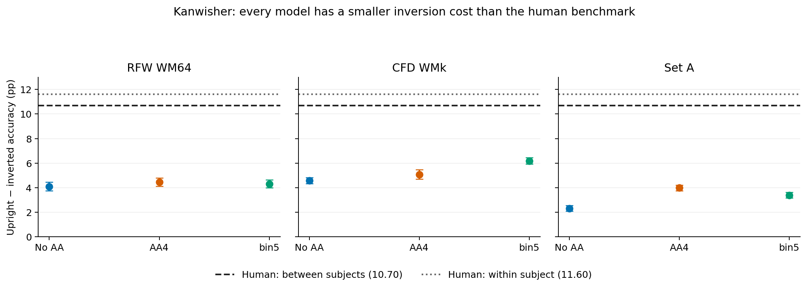

# Four VGG16-BN models: behavioral results and training curves

Compiled 28 September 2026 from saved seed results. **No behavioral simulations were rerun.**

## The four models

- **VGG2k / no AA** — VGG16-BN without antialiasing; 2,048 VGGFace2 training identities, plus objects and houses.
- **VGG2k / AA4** — VGG16-BN with the 4-tap [1,3,3,1] antialias filter; the same VGG2k, object, and house diet.
- **VGG2k / bin5** — VGG16-BN with the 5-tap [1,4,6,4,1] antialias filter; the same VGG2k, object, and house diet.
- **Mixed faces / AA4** — VGG16-BN with the 4-tap antialias filter; the older mixed face diet (VGGFace2, CelebA, RFW), plus objects and houses.

All four use the log-polar front end, a 256-unit bottleneck, training seed 42, and a ten-stage, 124-epoch curriculum. The main comparison uses **final epoch 124**, not each model’s validation-best checkpoint. AA4 and bin5 name the normalized binomial filters; there are three VGG2k models in total, two of them antialiased.

## The three Yin protocols

Each entry below is **study noise / test noise**. Noise flips bits in the sampled representation in both phases. U = upright, I = inverted; the first condition letter is study orientation. `single_noise` in the newer report is the same protocol as `single_uu` here.

| Protocol | UU | II | UI | IU | Calibration |
| --- | --- | --- | --- | --- | --- |
| `single_uu` | p1/p1 | p1/p1 | p1/p1 | p1/p1 | Fit p1 to UU; reuse it everywhere. |
| `two_cross` | p1/p1 | p2/p2 | p1/p2 | p2/p1 | Fit p1 to UU and p2 independently to II. |
| `two_shared_ui` | p1/p1 | p2/p2 | p1/p1 | p2/p1 | Same two fits; UI uses the upright noise rate in both phases. |

**`calibrated_on` identifies the stimulus set that chose the noise rates; `category` identifies what was evaluated.** RFW and CFD rates transfer unchanged to objects and houses. Category-specific calibration is a separate setting of `single_uu`, not a fourth protocol. It exists for AA4 VGG2k and mixed-face AA4 only.

The newer no-AA/bin5 report listed two protocols, but its saved transfer records already contain every cell needed for `two_shared_ui`. This report assembles those matching records without additional evaluations.

## How to read this report

- Start with the judgment and overview below. Use the [interactive comparison](vgg16bn_results_report.html) to select one protocol, calibration, and category at a time (four model rows).
- Expand a category below for exact values. Yin values are **mean ± SD across 50 simulation seeds (101–150)**, not uncertainty across trained models. Full precision and provenance are in the [80-row result file](vgg16bn_report_data/yin_results.csv) and [condition file](vgg16bn_report_data/yin_conditions.csv).
- Earlier checkpoints and category-specific fits have their own sections. Repeated summaries of the same seed results count once. The latest Kanwisher results appear at the end.

## Human reference

| Category | UU | II | UI | IU | IU − II |
| --- | ---: | ---: | ---: | ---: | ---: |
| Faces | 96.29 | 81.88 | 84.13 | 78.58 | -3.30 |
| Objects | 84.79 | 83.96 | 86.71 | 82.75 | -1.21 |
| Houses | 90.71 | 85.75 | 88.08 | 85.71 | -0.04 |

These are the repository’s Yin (1969) reference means. They are **not human measurements on RFW, CFD, or the model’s house/object images**. The repository’s “objects” reference is Yin’s airplanes. Human means come from [the original project tables](yin_replication.tex) and [the saved reference table](../runs/yin_noise_matrix_20260926/human_references.csv). Model seed SD and human participant SD are different quantities; plots show the reference mean only.

## Which results look most like humans?

**Closest final-checkpoint face predictions numerically: VGG2k / AA4, `two_cross`, calibrated on RFW WM64.** Its mean absolute error on the two unfitted face cells, UI and IU, is **2.81 pp**. The accuracies are UI 85.58% and IU 82.75%, versus human 84.13% and 78.58%. IU remains too high and sits above II, whereas the human IU is below II.

**My preferred final-model face-pattern candidate is mixed faces / AA4, `two_cross`, RFW calibration.** It is a little less close numerically (UI/IU error 3.23 pp), but reproduces the human ordering **UU > UI > II > IU**: 95.67, 85.92, 83.67, 83.25%. Its IU–II gap is only −0.42 pp versus the human −3.30 pp, so this remains an incomplete match. The `two_shared_ui` version preserves that ordering but moves UI farther from the human value.

**Across all three categories with one face calibration, the lowest balanced error is VGG2k / bin5, `two_cross`, calibrated on CFD WM64 (9.79 pp).** Its lead over mixed-face AA4 with CFD `two_cross` is only 0.15 pp, so the descriptive ranking does not establish a clear winner. Objects remain too accurate and houses too inaccurate. A face winner should therefore not be presented as the winner across categories.

**When objects/houses can choose their own noise rate**, AA4 VGG2k with `single_uu` is the strongest available category-fit candidate: object error on II/UI/IU is 2.78 pp; house error is 4.57 pp. The house II value is 92.67%, above UU 90.58%, while humans show the opposite ordering. No own-category runs are available for no-AA or bin5, so this is not a complete four-model comparison.

**The earlier mixed-face AA4 epoch-111 snapshot is the closest saved face UI/IU result** (RFW, `two_cross`, 1.35 pp error). It is an earlier checkpoint selected after seeing these results, and not evidence that the final model achieves that fit. It also puts IU above II.

### How the comparisons were scored

MAE is the average absolute model–human difference in percentage points. For a fair face comparison across protocols, the ranking uses the common unfitted cells **UI and IU**; fitting UU/II close to the human target does not count as independent predictive success. The balanced score averages three errors with equal category weight: face UI/IU MAE, object four-cell MAE, and house four-cell MAE. Object/house cells are all predictions when noise was fitted on faces. The numerical ranking is descriptive: one training seed, shared fitting/evaluation seeds, no uncertainty for the human means, and no correction for selecting among many settings.

| Model | Protocol | calibrated_on | Face UI/IU MAE | Object MAE | House MAE | Balanced MAE |
| --- | --- | --- | ---: | ---: | ---: | ---: |
| VGG2k / bin5 | two_cross | CFD WM64 | 4.94 | 6.49 | 17.94 | 9.79 |
| Mixed faces / AA4 | two_cross | CFD WM64 | 3.85 | 12.72 | 13.25 | 9.94 |
| VGG2k / bin5 | two_cross | RFW WM64 | 3.98 | 5.36 | 20.58 | 9.98 |
| Mixed faces / AA4 | two_shared_ui | CFD WM64 | 4.40 | 12.78 | 13.08 | 10.09 |
| VGG2k / no AA | two_cross | RFW WM64 | 5.02 | 5.14 | 20.60 | 10.25 |
| Mixed faces / AA4 | single_uu | CFD WM64 | 6.06 | 13.22 | 11.52 | 10.27 |

[All ranking scores](vgg16bn_report_data/rankings.csv). Lower is closer; red cells reveal where an apparently good face fit fails to transfer.

## Final-checkpoint Yin results

All **72 combinations** are included: 4 models × 3 protocols × 2 face calibrations × 3 categories. Each expanded table has eight rows. Values are mean ± SD (%); the final column is four-cell MAE in percentage points, including calibration cells where applicable.

### single_uu

Faces: all four models × two calibrations

**Human UU / II / UI / IU:** 96.29 / 81.88 / 84.13 / 78.58.

| Model | Protocol | calibrated_on | Category | UU | II | UI | IU | MAE vs human |
| --- | --- | --- | --- | ---: | ---: | ---: | ---: | ---: |
| VGG2k / no AA | single_uu | RFW WM64 | Faces | 96.67 ± 4.21 | 90.75 ± 5.34 | 91.00 ± 6.32 | 90.08 ± 5.32 | 6.91 |
| VGG2k / no AA | single_uu | CFD WM64 | Faces | 96.08 ± 3.80 | 89.58 ± 4.85 | 90.58 ± 5.88 | 90.25 ± 4.73 | 6.51 |
| VGG2k / AA4 | single_uu | RFW WM64 | Faces | 96.58 ± 3.44 | 91.67 ± 4.61 | 91.33 ± 4.52 | 90.50 ± 5.46 | 7.30 |
| VGG2k / AA4 | single_uu | CFD WM64 | Faces | 96.83 ± 3.63 | 92.83 ± 4.21 | 91.58 ± 4.80 | 92.00 ± 5.31 | 8.09 |
| VGG2k / bin5 | single_uu | RFW WM64 | Faces | 96.75 ± 3.40 | 91.33 ± 5.25 | 91.00 ± 6.81 | 88.17 ± 6.32 | 6.59 |
| VGG2k / bin5 | single_uu | CFD WM64 | Faces | 96.58 ± 3.54 | 90.75 ± 4.93 | 90.33 ± 5.92 | 88.50 ± 7.07 | 6.32 |
| Mixed faces / AA4 | single_uu | RFW WM64 | Faces | 95.67 ± 3.76 | 90.25 ± 6.39 | 87.67 ± 6.46 | 87.33 ± 6.24 | 5.32 |
| Mixed faces / AA4 | single_uu | CFD WM64 | Faces | 96.17 ± 3.75 | 89.92 ± 7.10 | 88.17 ± 6.59 | 86.67 ± 7.43 | 5.07 |

Objects: all four models × two calibrations

**Human UU / II / UI / IU:** 84.79 / 83.96 / 86.71 / 82.75.

| Model | Protocol | calibrated_on | Category | UU | II | UI | IU | MAE vs human |
| --- | --- | --- | --- | ---: | ---: | ---: | ---: | ---: |
| VGG2k / no AA | single_uu | RFW WM64 | Objects | 93.17 ± 5.10 | 92.83 ± 4.98 | 90.17 ± 5.24 | 90.75 ± 5.67 | 7.18 |
| VGG2k / no AA | single_uu | CFD WM64 | Objects | 94.67 ± 4.04 | 94.00 ± 4.55 | 91.75 ± 5.22 | 92.75 ± 4.44 | 8.74 |
| VGG2k / AA4 | single_uu | RFW WM64 | Objects | 93.17 ± 5.03 | 93.92 ± 4.39 | 88.83 ± 5.08 | 90.67 ± 5.49 | 7.09 |
| VGG2k / AA4 | single_uu | CFD WM64 | Objects | 95.58 ± 3.80 | 96.08 ± 3.51 | 91.58 ± 5.55 | 93.25 ± 4.37 | 9.57 |
| VGG2k / bin5 | single_uu | RFW WM64 | Objects | 95.33 ± 4.26 | 91.83 ± 4.91 | 88.42 ± 6.32 | 91.50 ± 5.64 | 7.22 |
| VGG2k / bin5 | single_uu | CFD WM64 | Objects | 95.50 ± 4.52 | 92.42 ± 4.66 | 89.92 ± 6.13 | 93.25 ± 4.52 | 8.22 |
| Mixed faces / AA4 | single_uu | RFW WM64 | Objects | 96.17 ± 4.11 | 95.50 ± 3.93 | 93.00 ± 4.79 | 94.75 ± 4.28 | 10.30 |
| Mixed faces / AA4 | single_uu | CFD WM64 | Objects | 98.33 ± 2.38 | 99.00 ± 1.80 | 95.75 ± 3.62 | 98.00 ± 2.69 | 13.22 |

Houses: all four models × two calibrations

**Human UU / II / UI / IU:** 90.71 / 85.75 / 88.08 / 85.71.

| Model | Protocol | calibrated_on | Category | UU | II | UI | IU | MAE vs human |
| --- | --- | --- | --- | ---: | ---: | ---: | ---: | ---: |
| VGG2k / no AA | single_uu | RFW WM64 | Houses | 69.42 ± 8.01 | 72.17 ± 8.39 | 70.25 ± 8.16 | 68.00 ± 7.21 | 17.60 |
| VGG2k / no AA | single_uu | CFD WM64 | Houses | 71.58 ± 7.47 | 75.50 ± 6.72 | 70.67 ± 7.14 | 70.83 ± 7.09 | 15.42 |
| VGG2k / AA4 | single_uu | RFW WM64 | Houses | 64.67 ± 9.08 | 69.17 ± 8.16 | 62.25 ± 8.96 | 61.75 ± 8.82 | 23.10 |
| VGG2k / AA4 | single_uu | CFD WM64 | Houses | 70.50 ± 7.89 | 73.42 ± 7.89 | 68.17 ± 9.10 | 64.58 ± 9.19 | 18.40 |
| VGG2k / bin5 | single_uu | RFW WM64 | Houses | 68.58 ± 8.72 | 72.00 ± 8.16 | 69.92 ± 8.56 | 68.25 ± 9.37 | 17.87 |
| VGG2k / bin5 | single_uu | CFD WM64 | Houses | 71.58 ± 8.15 | 74.83 ± 7.14 | 69.42 ± 7.60 | 70.42 ± 9.53 | 16.00 |
| Mixed faces / AA4 | single_uu | RFW WM64 | Houses | 70.83 ± 8.91 | 68.17 ± 9.17 | 63.42 ± 8.80 | 65.00 ± 8.99 | 20.71 |
| Mixed faces / AA4 | single_uu | CFD WM64 | Houses | 79.92 ± 7.23 | 78.42 ± 6.61 | 73.17 ± 7.44 | 72.67 ± 8.55 | 11.52 |

### two_cross

Faces: all four models × two calibrations

**Human UU / II / UI / IU:** 96.29 / 81.88 / 84.13 / 78.58.

| Model | Protocol | calibrated_on | Category | UU | II | UI | IU | MAE vs human |
| --- | --- | --- | --- | ---: | ---: | ---: | ---: | ---: |
| VGG2k / no AA | two_cross | RFW WM64 | Faces | 96.67 ± 4.21 | 82.75 ± 8.63 | 87.17 ± 8.11 | 85.58 ± 6.53 | 2.82 |
| VGG2k / no AA | two_cross | CFD WM64 | Faces | 96.08 ± 3.80 | 81.25 ± 7.25 | 88.33 ± 6.79 | 86.58 ± 5.79 | 3.26 |
| VGG2k / AA4 | two_cross | RFW WM64 | Faces | 96.58 ± 3.44 | 80.67 ± 8.90 | 85.58 ± 6.95 | 82.75 ± 7.14 | 1.78 |
| VGG2k / AA4 | two_cross | CFD WM64 | Faces | 96.83 ± 3.63 | 83.25 ± 7.12 | 88.83 ± 5.92 | 85.75 ± 7.15 | 3.45 |
| VGG2k / bin5 | two_cross | RFW WM64 | Faces | 96.75 ± 3.40 | 82.75 ± 7.43 | 87.50 ± 7.14 | 83.17 ± 7.62 | 2.32 |
| VGG2k / bin5 | two_cross | CFD WM64 | Faces | 96.58 ± 3.54 | 82.33 ± 7.17 | 87.42 ± 6.10 | 85.17 ± 6.90 | 2.66 |
| Mixed faces / AA4 | two_cross | RFW WM64 | Faces | 95.67 ± 3.76 | 83.67 ± 7.98 | 85.92 ± 7.09 | 83.25 ± 6.97 | 2.22 |
| Mixed faces / AA4 | two_cross | CFD WM64 | Faces | 96.17 ± 3.75 | 82.83 ± 7.93 | 87.08 ± 7.01 | 83.33 ± 8.58 | 2.20 |

Objects: all four models × two calibrations

**Human UU / II / UI / IU:** 84.79 / 83.96 / 86.71 / 82.75.

| Model | Protocol | calibrated_on | Category | UU | II | UI | IU | MAE vs human |
| --- | --- | --- | --- | ---: | ---: | ---: | ---: | ---: |
| VGG2k / no AA | two_cross | RFW WM64 | Objects | 93.17 ± 5.10 | 89.00 ± 5.63 | 87.58 ± 5.98 | 89.00 ± 6.23 | 5.14 |
| VGG2k / no AA | two_cross | CFD WM64 | Objects | 94.67 ± 4.04 | 91.08 ± 5.32 | 90.33 ± 5.86 | 90.25 ± 5.75 | 7.03 |
| VGG2k / AA4 | two_cross | RFW WM64 | Objects | 93.17 ± 5.03 | 86.08 ± 6.05 | 87.58 ± 6.38 | 87.42 ± 7.02 | 4.01 |
| VGG2k / AA4 | two_cross | CFD WM64 | Objects | 95.58 ± 3.80 | 92.42 ± 4.66 | 90.50 ± 5.05 | 90.33 ± 5.48 | 7.66 |
| VGG2k / bin5 | two_cross | RFW WM64 | Objects | 95.33 ± 4.26 | 86.58 ± 5.34 | 88.08 ± 5.95 | 89.67 ± 5.21 | 5.36 |
| VGG2k / bin5 | two_cross | CFD WM64 | Objects | 95.50 ± 4.52 | 88.83 ± 5.48 | 89.00 ± 6.17 | 90.83 ± 5.19 | 6.49 |
| Mixed faces / AA4 | two_cross | RFW WM64 | Objects | 96.17 ± 4.11 | 92.75 ± 4.28 | 92.00 ± 5.76 | 93.00 ± 4.87 | 8.93 |
| Mixed faces / AA4 | two_cross | CFD WM64 | Objects | 98.33 ± 2.38 | 98.08 ± 2.69 | 95.50 ± 3.65 | 97.17 ± 3.20 | 12.72 |

Houses: all four models × two calibrations

**Human UU / II / UI / IU:** 90.71 / 85.75 / 88.08 / 85.71.

| Model | Protocol | calibrated_on | Category | UU | II | UI | IU | MAE vs human |
| --- | --- | --- | --- | ---: | ---: | ---: | ---: | ---: |
| VGG2k / no AA | two_cross | RFW WM64 | Houses | 69.42 ± 8.01 | 63.58 ± 8.82 | 68.33 ± 8.38 | 66.50 ± 8.67 | 20.60 |
| VGG2k / no AA | two_cross | CFD WM64 | Houses | 71.58 ± 7.47 | 67.92 ± 8.76 | 69.67 ± 8.25 | 67.33 ± 7.64 | 18.44 |
| VGG2k / AA4 | two_cross | RFW WM64 | Houses | 64.67 ± 9.08 | 61.25 ± 10.39 | 59.17 ± 10.61 | 55.08 ± 10.92 | 27.52 |
| VGG2k / AA4 | two_cross | CFD WM64 | Houses | 70.50 ± 7.89 | 64.67 ± 8.92 | 65.67 ± 9.51 | 59.00 ± 8.60 | 22.60 |
| VGG2k / bin5 | two_cross | RFW WM64 | Houses | 68.58 ± 8.72 | 65.67 ± 9.80 | 67.25 ± 8.33 | 66.42 ± 8.14 | 20.58 |
| VGG2k / bin5 | two_cross | CFD WM64 | Houses | 71.58 ± 8.15 | 68.92 ± 8.13 | 69.58 ± 8.22 | 68.42 ± 8.83 | 17.94 |
| Mixed faces / AA4 | two_cross | RFW WM64 | Houses | 70.83 ± 8.91 | 63.33 ± 9.92 | 61.25 ± 8.76 | 63.00 ± 9.36 | 22.96 |
| Mixed faces / AA4 | two_cross | CFD WM64 | Houses | 79.92 ± 7.23 | 73.92 ± 6.62 | 72.50 ± 7.53 | 70.92 ± 7.46 | 13.25 |

### two_shared_ui

Faces: all four models × two calibrations

**Human UU / II / UI / IU:** 96.29 / 81.88 / 84.13 / 78.58.

| Model | Protocol | calibrated_on | Category | UU | II | UI | IU | MAE vs human |
| --- | --- | --- | --- | ---: | ---: | ---: | ---: | ---: |
| VGG2k / no AA | two_shared_ui | RFW WM64 | Faces | 96.67 ± 4.21 | 82.75 ± 8.63 | 91.00 ± 6.32 | 85.58 ± 6.53 | 3.78 |
| VGG2k / no AA | two_shared_ui | CFD WM64 | Faces | 96.08 ± 3.80 | 81.25 ± 7.25 | 90.58 ± 5.88 | 86.58 ± 5.79 | 3.82 |
| VGG2k / AA4 | two_shared_ui | RFW WM64 | Faces | 96.58 ± 3.44 | 80.67 ± 8.90 | 91.33 ± 4.52 | 82.75 ± 7.14 | 3.22 |
| VGG2k / AA4 | two_shared_ui | CFD WM64 | Faces | 96.83 ± 3.63 | 83.25 ± 7.12 | 91.58 ± 4.80 | 85.75 ± 7.15 | 4.13 |
| VGG2k / bin5 | two_shared_ui | RFW WM64 | Faces | 96.75 ± 3.40 | 82.75 ± 7.43 | 91.00 ± 6.81 | 83.17 ± 7.62 | 3.20 |
| VGG2k / bin5 | two_shared_ui | CFD WM64 | Faces | 96.58 ± 3.54 | 82.33 ± 7.17 | 90.33 ± 5.92 | 85.17 ± 6.90 | 3.38 |
| Mixed faces / AA4 | two_shared_ui | RFW WM64 | Faces | 95.67 ± 3.76 | 83.67 ± 7.98 | 87.67 ± 6.46 | 83.25 ± 6.97 | 2.65 |
| Mixed faces / AA4 | two_shared_ui | CFD WM64 | Faces | 96.17 ± 3.75 | 82.83 ± 7.93 | 88.17 ± 6.59 | 83.33 ± 8.58 | 2.47 |

Objects: all four models × two calibrations

**Human UU / II / UI / IU:** 84.79 / 83.96 / 86.71 / 82.75.

| Model | Protocol | calibrated_on | Category | UU | II | UI | IU | MAE vs human |
| --- | --- | --- | --- | ---: | ---: | ---: | ---: | ---: |
| VGG2k / no AA | two_shared_ui | RFW WM64 | Objects | 93.17 ± 5.10 | 89.00 ± 5.63 | 90.17 ± 5.24 | 89.00 ± 6.23 | 5.78 |
| VGG2k / no AA | two_shared_ui | CFD WM64 | Objects | 94.67 ± 4.04 | 91.08 ± 5.32 | 91.75 ± 5.22 | 90.25 ± 5.75 | 7.39 |
| VGG2k / AA4 | two_shared_ui | RFW WM64 | Objects | 93.17 ± 5.03 | 86.08 ± 6.05 | 88.83 ± 5.08 | 87.42 ± 7.02 | 4.32 |
| VGG2k / AA4 | two_shared_ui | CFD WM64 | Objects | 95.58 ± 3.80 | 92.42 ± 4.66 | 91.58 ± 5.55 | 90.33 ± 5.48 | 7.93 |
| VGG2k / bin5 | two_shared_ui | RFW WM64 | Objects | 95.33 ± 4.26 | 86.58 ± 5.34 | 88.42 ± 6.32 | 89.67 ± 5.21 | 5.45 |
| VGG2k / bin5 | two_shared_ui | CFD WM64 | Objects | 95.50 ± 4.52 | 88.83 ± 5.48 | 89.92 ± 6.13 | 90.83 ± 5.19 | 6.72 |
| Mixed faces / AA4 | two_shared_ui | RFW WM64 | Objects | 96.17 ± 4.11 | 92.75 ± 4.28 | 93.00 ± 4.79 | 93.00 ± 4.87 | 9.18 |
| Mixed faces / AA4 | two_shared_ui | CFD WM64 | Objects | 98.33 ± 2.38 | 98.08 ± 2.69 | 95.75 ± 3.62 | 97.17 ± 3.20 | 12.78 |

Houses: all four models × two calibrations

**Human UU / II / UI / IU:** 90.71 / 85.75 / 88.08 / 85.71.

| Model | Protocol | calibrated_on | Category | UU | II | UI | IU | MAE vs human |
| --- | --- | --- | --- | ---: | ---: | ---: | ---: | ---: |
| VGG2k / no AA | two_shared_ui | RFW WM64 | Houses | 69.42 ± 8.01 | 63.58 ± 8.82 | 70.25 ± 8.16 | 66.50 ± 8.67 | 20.12 |
| VGG2k / no AA | two_shared_ui | CFD WM64 | Houses | 71.58 ± 7.47 | 67.92 ± 8.76 | 70.67 ± 7.14 | 67.33 ± 7.64 | 18.19 |
| VGG2k / AA4 | two_shared_ui | RFW WM64 | Houses | 64.67 ± 9.08 | 61.25 ± 10.39 | 62.25 ± 8.96 | 55.08 ± 10.92 | 26.75 |
| VGG2k / AA4 | two_shared_ui | CFD WM64 | Houses | 70.50 ± 7.89 | 64.67 ± 8.92 | 68.17 ± 9.10 | 59.00 ± 8.60 | 21.98 |
| VGG2k / bin5 | two_shared_ui | RFW WM64 | Houses | 68.58 ± 8.72 | 65.67 ± 9.80 | 69.92 ± 8.56 | 66.42 ± 8.14 | 19.92 |
| VGG2k / bin5 | two_shared_ui | CFD WM64 | Houses | 71.58 ± 8.15 | 68.92 ± 8.13 | 69.42 ± 7.60 | 68.42 ± 8.83 | 17.98 |
| Mixed faces / AA4 | two_shared_ui | RFW WM64 | Houses | 70.83 ± 8.91 | 63.33 ± 9.92 | 63.42 ± 8.80 | 63.00 ± 9.36 | 22.42 |
| Mixed faces / AA4 | two_shared_ui | CFD WM64 | Houses | 79.92 ± 7.23 | 73.92 ± 6.62 | 73.17 ± 7.44 | 70.92 ± 7.46 | 13.08 |

## Category-specific calibration

These four additional combinations fit UU on the same category that is tested. The mixed-face model’s house target was outside the sampled calibration range: closest UU 87.25% versus 90.71% human (p = 0.02). This is a calibration limitation, not a successful UU match.

| Model | Protocol | calibrated_on | Category | UU | II | UI | IU | MAE vs human |
| --- | --- | --- | --- | ---: | ---: | ---: | ---: | ---: |
| VGG2k / AA4 | single_uu | Objects | Objects | 85.75 ± 7.20 | 86.08 ± 6.05 | 83.25 ± 7.46 | 85.50 ± 8.13 | 2.32 |
| VGG2k / AA4 | single_uu | Houses | Houses | 90.58 ± 5.57 | 92.67 ± 5.81 | 86.42 ± 6.12 | 80.58 ± 6.33 | 3.46 |
| Mixed faces / AA4 | single_uu | Objects | Objects | 85.08 ± 6.84 | 81.25 ± 7.20 | 80.67 ± 7.18 | 81.92 ± 9.47 | 2.47 |
| Mixed faces / AA4 | single_uu | Houses | Houses | 87.25 ± 5.48 | 84.67 ± 5.55 | 76.58 ± 6.51 | 78.42 ± 5.99 | 5.83 |

No-AA and bin5 category-specific results are **not available**. Their face-calibrated house/object results above must not be mistaken for own-category calibration.

## Earlier checkpoint snapshots

These four results appeared in the 25 September report before training finished. They are retained for completeness and excluded from the final-checkpoint ranking.

| Model | Protocol | calibrated_on | Category | Epoch | UU | II | UI | IU | MAE vs human |
| --- | --- | --- | --- | ---: | ---: | ---: | ---: | ---: | ---: |
| VGG2k / AA4 | two_cross | RFW WM64 | Faces | 105 | 96.00 ± 3.67 | 79.00 ± 8.16 | 86.58 ± 7.16 | 81.08 ± 6.59 | 2.03 |
| VGG2k / AA4 | two_cross | CFD WM64 | Faces | 105 | 96.67 ± 4.04 | 80.67 ± 7.42 | 87.92 ± 5.27 | 86.08 ± 6.92 | 3.22 |
| Mixed faces / AA4 | two_cross | RFW WM64 | Faces | 111 | 96.33 ± 3.54 | 80.00 ± 9.03 | 84.58 ± 7.49 | 80.83 ± 7.34 | 1.16 |
| Mixed faces / AA4 | two_cross | CFD WM64 | Faces | 111 | 96.17 ± 3.75 | 81.17 ± 9.00 | 86.58 ± 6.37 | 81.58 ± 9.11 | 1.57 |

## Calibration rates and coverage

| Model | calibrated_on | p1 (UU) | p2 (II) | Final epoch |
| --- | --- | ---: | ---: | ---: |
| VGG2k / no AA | RFW WM64 | 0.37 | 0.39 | 124 |
| VGG2k / no AA | CFD WM64 | 0.36 | 0.38 | 124 |
| VGG2k / AA4 | RFW WM64 | 0.37 | 0.40 | 124 |
| VGG2k / AA4 | CFD WM64 | 0.35 | 0.38 | 124 |
| VGG2k / bin5 | RFW WM64 | 0.37 | 0.39 | 124 |
| VGG2k / bin5 | CFD WM64 | 0.36 | 0.38 | 124 |
| Mixed faces / AA4 | RFW WM64 | 0.36 | 0.38 | 124 |
| Mixed faces / AA4 | CFD WM64 | 0.28 | 0.33 | 124 |

The same p1 supplies `single_uu`. All RFW/CFD face fits were within the sampled range, with residual error from the finite 0.01 refinement grid. Each evaluation used 40 studied items, 24 old/new pairs, 10 study fixations, 32 test fixations, and KDE width 2. Faces were shuffled per seed; objects/houses used the packed 40/24 split.

## Training curves

<!-- TRAINING_CURVES_START -->

**The test curve is confirmed to use 180° inverted images.** The overall plots use the original 124-epoch records. Per-category training was never logged; dashed training points evaluate the saved stage checkpoints instead. ZuBuD has no test split, so its dashed orange points evaluate inverted validation images.

[Open the training-curve report](vgg16bn_training_curves.md) for all category dashboards, individual PNG/PDF images, sampling details, and the validation/test split audit. The plots use history CSVs, not the best-checkpoint category statistics in `summary.json`.

VGG2k / no AA: overall and all categories

[Individual category figures and interpretation](vgg16bn_training_curves.md)

VGG2k / AA4: overall and all categories

[Individual category figures and interpretation](vgg16bn_training_curves.md)

VGG2k / bin5: overall and all categories

[Individual category figures and interpretation](vgg16bn_training_curves.md)

Mixed faces / AA4: overall and all categories

[Individual category figures and interpretation](vgg16bn_training_curves.md)

<!-- TRAINING_CURVES_END -->

## Sources and reproducibility

The compilation reads seed CSVs rather than transcribing rounded Markdown. It checks unique seeds, full counts, completed records, and equality of reused UU/UI cells. Exact source paths and checkpoint hashes accompany the [JSON data](vgg16bn_report_data/results.json); [source file hashes](vgg16bn_report_data/source_manifest.json) identify the audited inputs. The [generator](../reporting/build_vgg16bn_report.py) rebuilds the behavioral report and figures.

Source reports and supporting records

- [paper/yin_experiments_20260925.md](yin_experiments_20260925.md)
- [runs/yin_orientation_20260925/README.md](../runs/yin_orientation_20260925/README.md)
- [runs/yin_single_noise_20260925/README.md](../runs/yin_single_noise_20260925/README.md)
- [runs/yin_noise_matrix_20260926/REPORT.md](../runs/yin_noise_matrix_20260926/REPORT.md)
- [runs/yin_category_uu_20260926/REPORT.md](../runs/yin_category_uu_20260926/REPORT.md)
- [runs/yin_noaa_two_cross_20260927/REPORT.md](../runs/yin_noaa_two_cross_20260927/REPORT.md)
- [runs/yin_latest_vgg_20260927/REPORT.md](../runs/yin_latest_vgg_20260927/REPORT.md)
- [runs/kanw_latest_vgg_20260927/summary.md](../runs/kanw_latest_vgg_20260927/summary.md)
- [paper/curriculum_results_summary.md](curriculum_results_summary.md)
- [paper/yin_replication.tex](yin_replication.tex)

## Latest Kanwisher / Dobs matching results

These are the latest final-epoch results: **20 seeds (101–120)**, noise calibrated separately on each model/store to the 87.5% upright target using calibration seed 42. Here uncertainty is **SEM**, matching the Kanwisher source report (the Yin tables above use SD). Inversion cost is computed upright minus inverted within each seed.

| Human reference | Upright | Inverted | Inversion cost (pp) |
| --- | ---: | ---: | ---: |
| Between-subjects benchmark | 87.50 | 76.80 | 10.70 |
| Within-subject benchmark | 87.50 | 75.90 | 11.60 |

Human values are the project’s Dobs et al. (2023) references in [the existing results summary](curriculum_results_summary.md). They are benchmark values, not human data collected on these three model evaluation stores.

### RFW WM64

| Model | Protocol | calibrated_on | Category | p | Upright ± SEM | Inverted ± SEM | Cost ± SEM |
| --- | --- | --- | --- | ---: | ---: | ---: | ---: |
| VGG2k / no AA | Kanwisher matching | RFW WM64 | RFW WM64 | 0.40 | 87.00 ± 0.36 | 82.90 ± 0.36 | 4.10 ± 0.36 |
| VGG2k / AA4 | Kanwisher matching | RFW WM64 | RFW WM64 | 0.40 | 87.18 ± 0.27 | 82.73 ± 0.36 | 4.46 ± 0.34 |
| VGG2k / bin5 | Kanwisher matching | RFW WM64 | RFW WM64 | 0.39 | 89.14 ± 0.29 | 84.82 ± 0.35 | 4.32 ± 0.32 |

### CFD WMk

| Model | Protocol | calibrated_on | Category | p | Upright ± SEM | Inverted ± SEM | Cost ± SEM |
| --- | --- | --- | --- | ---: | ---: | ---: | ---: |
| VGG2k / no AA | Kanwisher matching | CFD WMk | CFD WMk | 0.42 | 89.42 ± 0.24 | 84.85 ± 0.14 | 4.58 ± 0.24 |
| VGG2k / AA4 | Kanwisher matching | CFD WMk | CFD WMk | 0.42 | 89.51 ± 0.24 | 84.42 ± 0.26 | 5.09 ± 0.38 |
| VGG2k / bin5 | Kanwisher matching | CFD WMk | CFD WMk | 0.42 | 89.88 ± 0.20 | 83.68 ± 0.19 | 6.19 ± 0.27 |

### Set A

| Model | Protocol | calibrated_on | Category | p | Upright ± SEM | Inverted ± SEM | Cost ± SEM |
| --- | --- | --- | --- | ---: | ---: | ---: | ---: |
| VGG2k / no AA | Kanwisher matching | Set A | Set A | 0.38 | 88.04 ± 0.14 | 85.72 ± 0.17 | 2.32 ± 0.24 |
| VGG2k / AA4 | Kanwisher matching | Set A | Set A | 0.39 | 87.12 ± 0.16 | 83.12 ± 0.20 | 3.99 ± 0.24 |
| VGG2k / bin5 | Kanwisher matching | Set A | Set A | 0.36 | 90.39 ± 0.16 | 87.00 ± 0.20 | 3.39 ± 0.23 |

**None reproduces the human inversion cost.** Bin5 with CFD calibration has the largest, closest cost (6.19 pp), still 4.51 pp below the 10.70 pp benchmark. If judged only on the predicted inverted accuracy, AA4 VGG2k with RFW calibration is closest (82.73%, 5.93 pp above 76.80%); its cost is only 4.46 pp. The preferred candidate therefore depends on whether the criterion is accuracy level or inversion sensitivity.

The latest batch contains the three VGG2k variants; **mixed-face AA4 is not present**. RFW samples 40 identities from `faces_rfwWM64` (four photos each); CFD uses 36 identities from **`faces_cfdWMk`**, a different store from Yin’s CFD WM64; Set A uses 40 identities with five photos each. Each trial matches different photos of the same person against another identity.

[Latest source report](../runs/kanw_latest_vgg_20260927/summary.md) · [Exact means, SEMs, and provenance](vgg16bn_report_data/kanwisher_results.csv)
